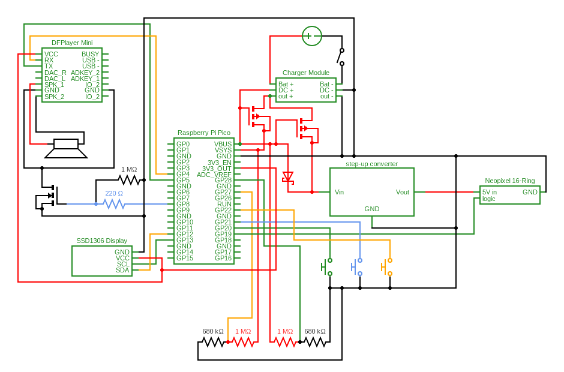

# Raspberry Pi Pico Alarmclock written in Rust

[](https://github.com/1-rafael-1/pi-pico-alarmclock-rust/actions/workflows/ci.yml)

Building a (hopefully working) alarmclock based on a Raspberry Pi Pico W written in Rust and using the Embassy framework.

This is a picture of the prototype on a breadboard, in a box with bits of hardware dangling on their wires. Not pretty, but before i build a proper one in its enclosure it must do: 


## Features

+ **DateTime Retrieval**:
    + DateTime is obtained through a web request to `worldtimeapi.org` on device startup and refreshed every 6 hours.

+ **Display Modes**:
    + **Normal Mode**:
        + Shows the time in hours and minutes using a custom-made set of number images modeled after a StarWars font.
        + Displays the date and day of the week as text.
        + Shows an image of a lightsaber to indicate whether the alarm is active.
        + Includes a battery indicator showing whether the device is powered by USB or battery, and if by battery, also indicates the charge level.
    + **Setting Mode**:
        + Displays the currently saved alarm time in hours and minutes.
        + Shows an indicator that the device is in setup mode.
    + **Menu Mode**:
        + Displays a menu offering options to put the device into standby or view system information (mostly measured power supply voltage) and voltage bounds.

+ **Neopixel Ring**:
    + A 16-LED Neopixel Ring is used for visual effects. In normal mode with the alarm not active, an analog clock is simulated with the hour indicated in red, the minutes in green, and the seconds in blue. Whenever the hands meet, their colors mix. The analog clock is shown as long as the alarm is not active. When the alarm is active the leds remain off until an alarm is triggered. See below.

+ **MP3 Module and Speaker**:
    + A MP3 module and a 3W speaker are used to play the Imperial March as the alarm tone.

+ **Power Supply**:
    + Power is supplied from a 18650 Li-ion battery or via USB. When on USB, the Li-ion battery is charged. The device immediately changes the display and performs a voltage measurement when switching between USB and battery power.

+ **Push Buttons**:
    + Three push buttons (green, blue, yellow) allow user interaction. Their actions depend on the system state:
        + **Normal Mode**:
            + Green toggles alarm active.
            + Blue enters alarm time setup.
            + Yellow enters menu.
        + **Alarm Time Setting Mode**:
            + Green increases hours, one per single press or continuously when holding the button down for more than a second.
            + Yellow increases minutes, one per single press or continuously when holding the button down for more than a second.
            + Blue saves the setting.
        + **Menu Mode**:
            + Green enters system info.
            + Blue enters device standby.
            + Yellow goes back to normal mode.
        + **System Info**:
            + Any button enters normal mode.
        + **Standby**:
            + Any button wakes the device.

+ **Alarm Trigger**:
    + When the alarm is triggered:
        + The Neopixel plays a sunrise effect, starting with morning-red light and gradually adding more LEDs, changing all LED colors towards warm white light. When that is concluded, a whirling rainbow effect is played until the alarm state is left.
        + As soon as the sunrise effect on the Neopixel is done, the alarm sound plays the Imperial March exactly one time. It is a long song, and after extensive testing, I am thoroughly fed up with it.
        + The device randomizes a sequence of buttons and displays text in the state area to "Press Yellow!" or one of the other two. The user must press the requested color until all three buttons have been pressed. If the user does not press the correct sequence, the alarm will continue.

+ **Device Standby**:
    + When entering Standby mode the display and the neopixel ring are turned off. Internally the scheduler task, the time updater task and the voltage measuring task are suspended. That way no activity is performed and the device powers down as much as the Pi Pico W allows for, besides circuit loss.
    + Pressing any button in Standby mode will wake the device. All tasks resume, and one initial call to the time service is made.

## Code

The project is written in Rust making heavy use of the Embassy framework. I have attempted to document the code extensively, mainly because writing explanations is what I do when I learn new things.

The general layout of the project is as follows:

+ The module `tasks` contains crates for the async tasks that make up the system. 
    + In this module the system state is described by `state.rs`.
    + Peripheral resources are defined in `resource.rs`.
    + The orchestration of the system is defined in `orchestrate.rs` where a scheduler task and an orchestrate task manage all system state changes.
    + Events and Commands for use throughout the tasks and the orchestrator are defined in `task_messages.rs`.
    + All other files define sepcific peripheral or system tasks.
+ The module `utility` is very small and defines some helper functions mainly for converting DateTime to and from String.
+ The folder `media` contains `bmp`-files used by the display task. These I made myself pixel by pixel, none of this is a copy.
+ The folder `wifi-firmware`contains the firmware for the wifi-chip, copied over from the Embassy repo for convenience.

To get the docs clone this repo and run this:
 
```Shell
cargo doc --open
```

## Building the Project

This project uses `defmt` for logging, which can be configured to include different log levels depending on whether you're building for development or production use. Log levels are controlled using the `DEFMT_LOG` environment variable at compile time.

### Debug Build

For development with all logging enabled (trace, debug, info, warn):

```Shell
cargo build
cargo run
```

This will include all `info!`, `debug!`, and `trace!` log statements, which are useful during development when connected to a debug probe. The logs are output via RTT (Real-Time Transfer) to your debugger.

### Release Build

For production use, you should build with reduced logging to prevent the RTT buffer from filling up and causing the device to hang when running standalone (without a debugger connected):

**Recommended: Warnings only**

```Shell
DEFMT_LOG=warn cargo build --release
DEFMT_LOG=warn cargo run --release
```

This will compile out all `info!` and `debug!` statements, keeping only `warn!` logs. This is the recommended configuration for flashing to a device that will run standalone.

**Info and above (moderate logging)**

```Shell
DEFMT_LOG=info cargo build --release
```

This keeps `info!` and `warn!` logs but removes `debug!` and `trace!`.

### Flashing Manually

To flash the device manually without a debug probe:

```Shell
DEFMT_LOG=warn cargo build --release
cargo install elf2uf2-rs
elf2uf2-rs .\target\thumbv6m-none-eabi\release\pi-pico-alarmclock
```

Then find the `uf2` file in the above folder and flash it manually to the Pi Pico by:
1. Hold the BOOTSEL button on the Pico while connecting it via USB
2. Copy the `uf2` file to the RPI-RP2 drive that appears

As an alternative, find the latest release and use the `uf2` file from there.

## Testing

For testing during development, use the debug build with a debug probe connected to see all logs in real-time.

## Circuit

This is my best attempt at a circuit diagram. Not knowing much about electronics and long-buried memories from school slowly re-loading from cold storage this was trial and error and a lot of googling before it worked. In this configuration I am reasonably sure it is okay to start soldering a first model.


## Enclosure

The enclosure is designed in Autodesk Fusion, a project Export of the design can be found here: [enclosure](enclosure/). 

A gallery of images can be found [here](enclosure/gallery.md).

## Assembly

This is still WIP, I have my first pair of burns to show for it, really not good at soldering... Will update when done.

## Components

|Component|Description|
|---------|---------|
|Microcontroller|Raspberry Pi Pico W|
|OLED Display|SSD1306 compatible I²C OLED Display 128*64 pixels with two color yellow/blue. Input Voltage 3.3V|
|battery|A 18650 Li-ion battery with 3350mAh. Anything else will work, as long as it fits with the charger module and outputs no more than 5V.|
|battery holder|really anything will do|
|power switch|Any simple switch to cut power between the battery and the charger module|
|charger module|A TC4056A module here, but any similar module will work, as long as it can be powered by pads and fits the Li-Ion battery specs. A managed charger that protects the battery is preferred.|
|NeoPixel ring|WS2812B with 16 RGB LED on it. This is the limit on what the power supply can handle.|
|step-up converter|U3V16F5 used here. Any other converter will do, that can convert the expected input between 2.5V and 5V and convert that to a steady 5V with 1000mA.|
|speaker|DFplayer Mini 3 Watt 8Ω speaker, 70*30*15mm. They can be found in some flavors from multiple vendors. Depending on the form factor, not all will fit into the enclosure as designed here.|
|p-channel MOSFET|Two IRF9540 used here. Other models will do, as long as the gate voltage of 3.3V is sufficient to fully switch (look for "logic-level MOSFET") and they can handle 5V safely. A ton of options exist and the ones used here are probably not the most ideal choice.|
|n-channel MOSFET|One IRLZ44N used here. Other models will do, as long as the gate voltage of 3.3V is sufficient to fully switch (look for "logic-level MOSFET") and it can handle 5V safely. A ton of options exist and the one used here is probably not the most ideal choice.|
|Schottky diode|One used, anything rated for 5V will do.|
|mp3 module|DFR0299 (DFPlayer)|
|micro sd card|Whatever, formatted to FAT32.|
|push button|Three used. 13mm diameter, 8mm hight caps on 12x12x7.3mm button - these should be fairly standard. One caps each in yellow, green and blue.|
|Resistors|Three 1MΩ, Two 680KΩ and one 220Ω|
|Wires|Plenty :-)|

## Disclaimer and Thanks

This is a hobby project and I have very little experience in electronics and had none before in Rust and also none before in Fusion. All three things i taught myself along the way. While this was incredible fun, this project will be full of imperfections, literally everywhere. In case You happen across this repo and spots a thing to improve - if You find the time to let me know, I will be more than happy. After all, this was and is about learning things.

That being said: This device does work, at least as far as I did test it to this point. 

Does the world need another alarmclock? Hell no, it does not. You can buy them in thousands of types for very little money and then most will have more functionality, better battery life, and whatnot. I was looking for a thing to do, had a joking conversation with my eldest daughter (who is in an age range where getting up in the morning appears to be terribly difficult) and that was that: I found myself building this thing.

While doing this I had a ton of help, and I am very sure this would have ended nowhere without:

+ [Embassy framework](https://github.com/embassy-rs/embassy): This is a Rust framework for embedded devices, with PACs for an number of different chips and boards and packed with great features focusing on async multitasking. The maintainers have piled up  - and that was really helpful to me - an impressive number of examples on how to do connect devices as well as conceptual stuff on how to solve diverse things. I am glad I could contribute back some examples to that to give back a little.
+ Embassy Community: While getting to grips with Rust and Embassy some very kind and patient individuals from the Embassy Community helped me with my questions, which were a mix of Rust-rookie questions and Embassy-rookie questions. That was an amazing experience, and I clearly would have either not managed or at the very least needed ages without.

We should also not forget, that in this day and age it is a lot easier to learn a new programming language, because we have AI help. In my case I found it helpful to use GitHub Copilot, although it does have an evil twist sometimes, because Rust has not the training data other more prevalent languages have. Rust embedded is then an even smaller subset of that, further degrading response quality. So good prompting is key, and even so the stupid thing keeps suggesting using Tokio, Serde, ... and many std-things. But still, you can always ask about concepts, see the suggestions, even if often technically wrong but often conceptually still helpful... it does speed up things considerably. I believe I would have managed without, but at a fraction of the speed.
