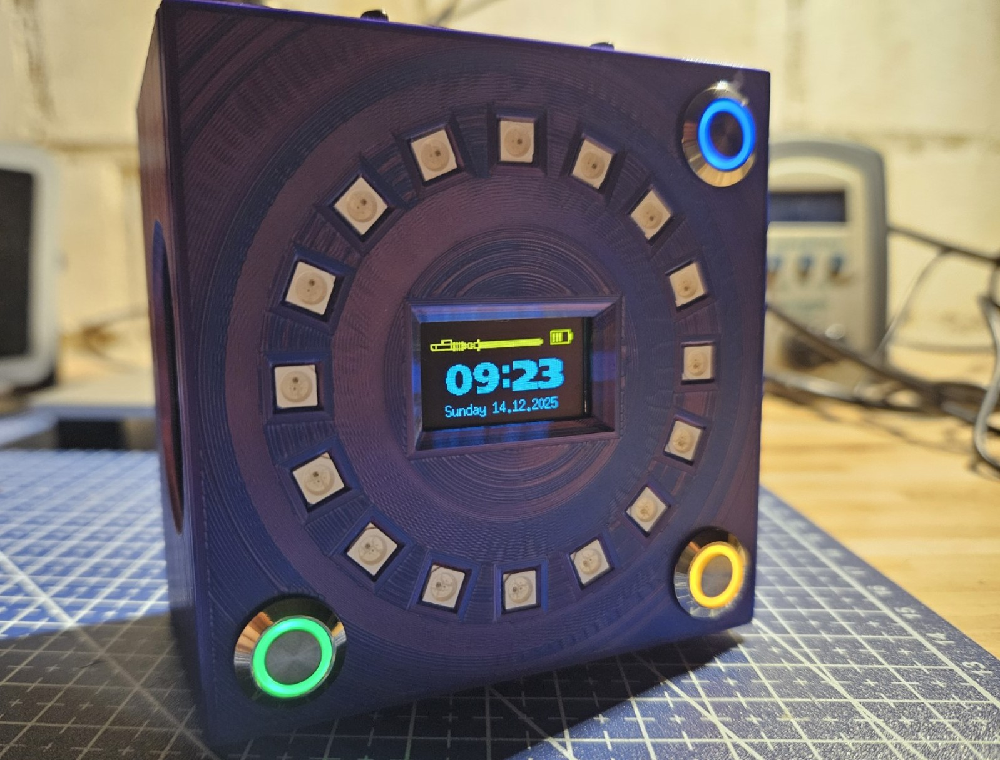
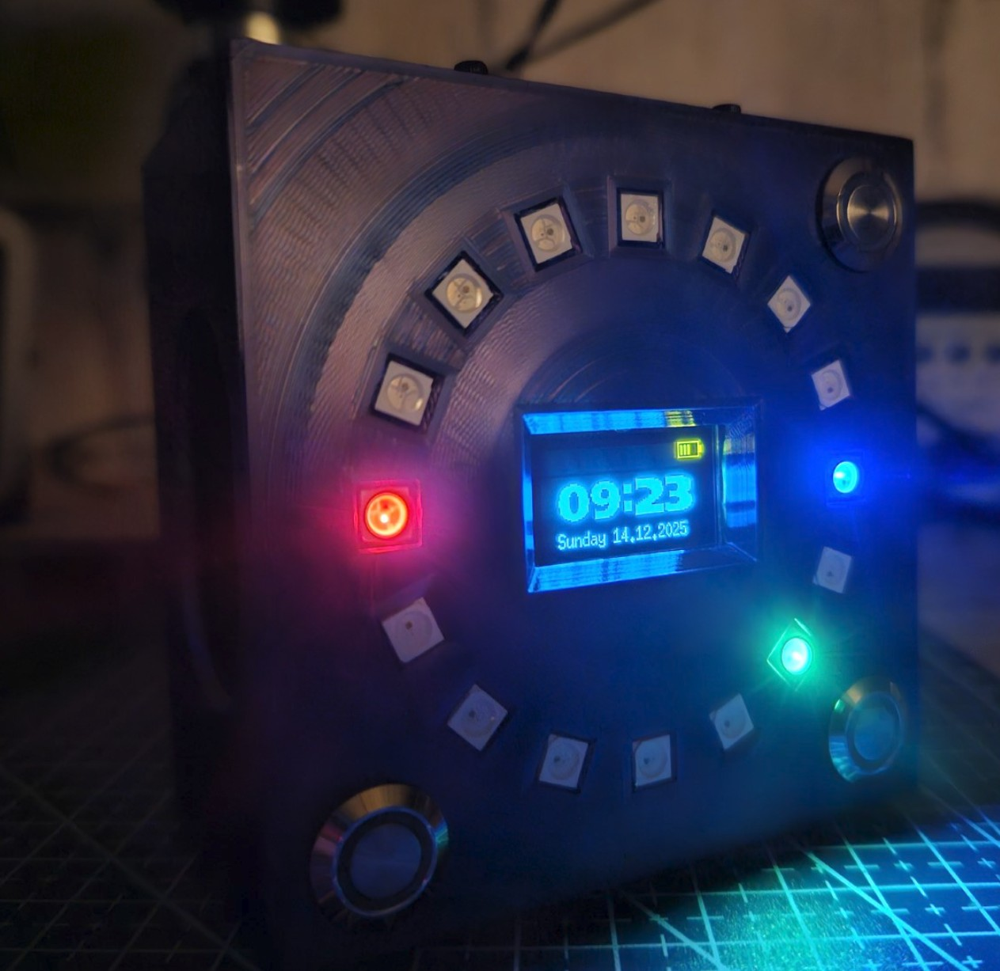
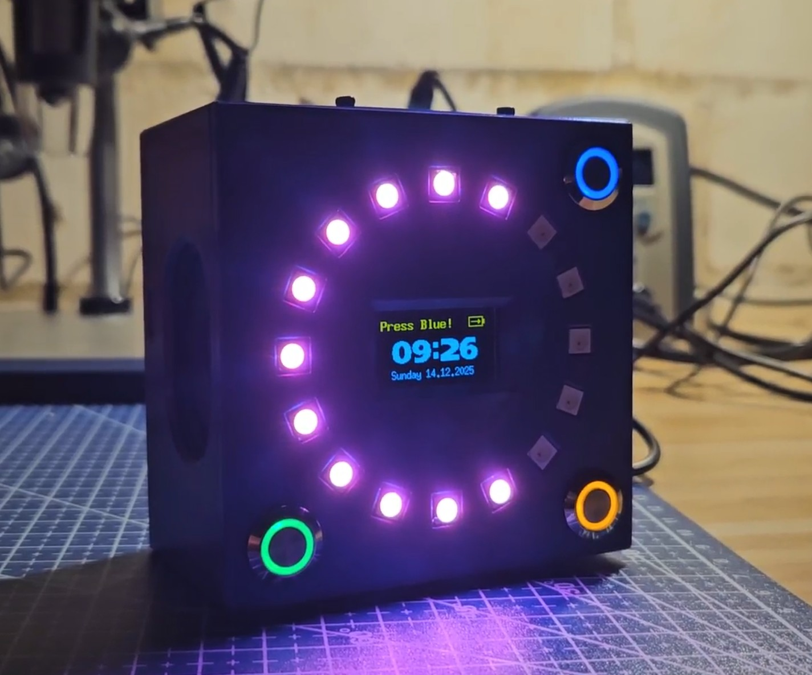
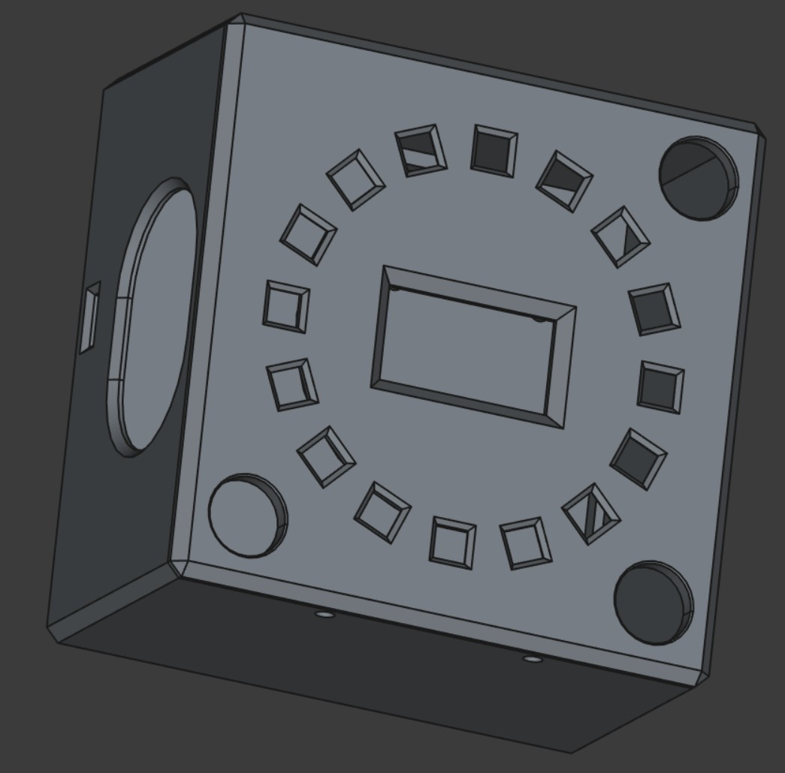
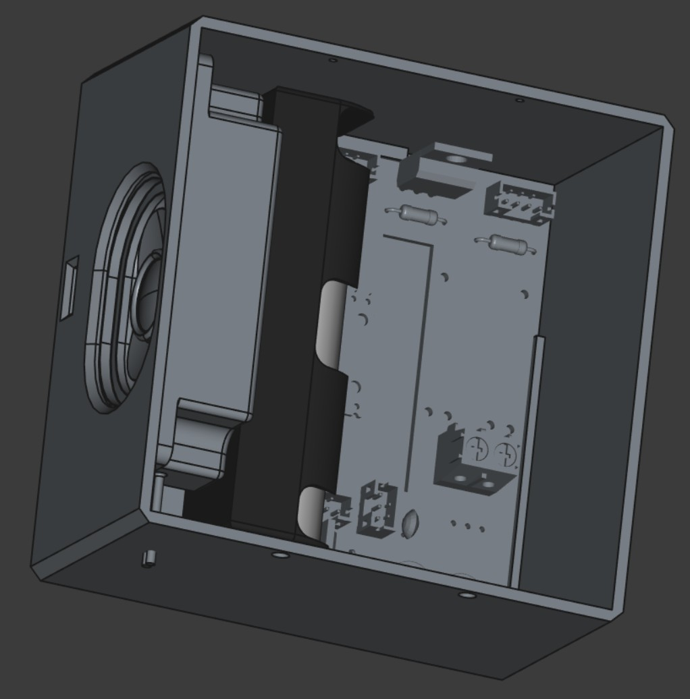
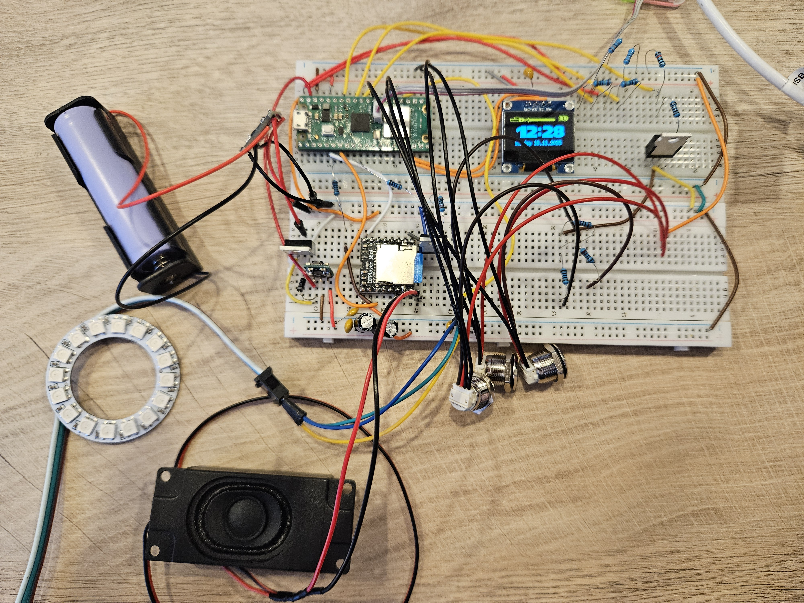
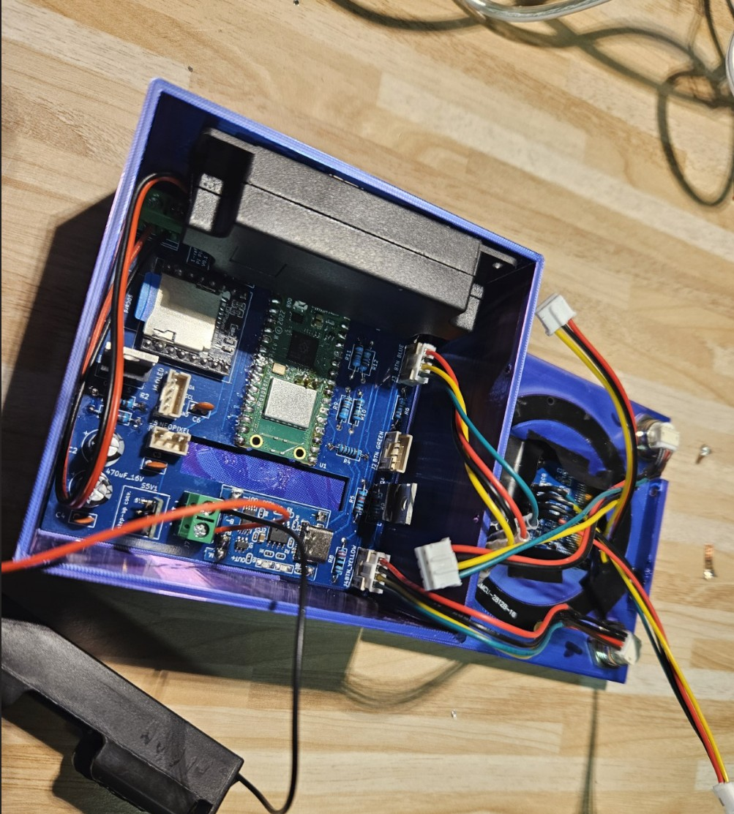

# Raspberry Pi Pico Alarmclock written in Rust

[](https://github.com/1-rafael-1/pi-pico-alarmclock-rust/actions/workflows/ci.yml)

A fully-featured alarm clock built on a Raspberry Pi Pico W, written in Rust using the Embassy async framework.

<div align="center">
  
  
  
</div>

*Left: Alarm enabled with lightsaber icon indicator. Center: The completed alarm clock showing the OLED display, NeoPixel ring with hour markers, and three illuminated control buttons (green, blue, yellow). Right: Alarm clock in operation with active NeoPixel LEDs displaying the analog clock.*

---

## Features at a Glance

### Core Functionality
- **WiFi Time Sync** - Automatic time synchronization via worldtimeapi.org (refreshed every 6 hours)
- **Alarm System** - Configurable alarm with sunrise light effect and audio playback
- **Visual Display** - 128×64 OLED display with custom Star Wars-inspired font
- **Analog Clock** - 16-LED NeoPixel ring showing hours (red), minutes (green), and seconds (blue)
- **Battery Powered** - 18650 Li-ion battery with USB charging and voltage monitoring

### User-Configurable Settings
- **Volume Control** (0-30) - Adjustable alarm sound volume, persisted to flash
- **LED Brightness** (0-20) - Adjustable NeoPixel clock brightness with live preview
- **Manual Time Setting** - Set time via buttons when WiFi unavailable or for DST adjustments

### Advanced Features
- **Multi-Mode Interface** - Normal, Menu, Settings, Alarm, System Info, and Standby modes
- **Smart Alarm** - Sunrise light effect followed by audio, with randomized button sequence to dismiss
- **Auto-Timeout Protection** - All menus and settings automatically return to Normal mode after 10 seconds of inactivity (with auto-save)
- **Power Management** - Standby mode with task suspension for minimal power consumption
- **Persistent Storage** - All settings saved to flash memory and survive power cycles

---

## Quick Start

### Build and Flash

This project uses **probe-rs** for debugging and flashing via a debug probe (e.g., Raspberry Pi Debug Probe, Picoprobe).

```bash
# Build and flash with probe-rs (recommended)
DEFMT_LOG=warn cargo run --release
```

See the [Building the Project](#building-the-project) section for more details.

### First Use

1. Power on the device - it will initialize and sync time via WiFi
2. Press **Yellow** to open the menu
3. Press **Green** to access Settings
4. Configure your preferences (volume, brightness, etc.)
5. Press **Blue** in Normal mode to set your alarm time
6. Press **Green** in Normal mode to toggle the alarm on/off

See the [User Manual](#user-manual) below for detailed instructions.

---

## Hardware Components

### Main Components
- Raspberry Pi Pico W (microcontroller with WiFi)
- SSD1306 OLED Display (128×64 pixels, I²C)
- DFPlayer Mini MP3 module (DFR0299)
- WS2812B NeoPixel Ring (16 RGB LEDs)
- 3W 8Ω Speaker
- 18650 Li-ion Battery (3350mAh)
- TC4056A Charger Module
- 5V Step-up Converter

### Interface
- 3× LED Ring Push Buttons (12mm, Green/Blue/Yellow)
- Micro SD card (FAT32, for alarm audio)

Complete bill of materials available in the [Components](#components-bill-of-materials) section below.

---

## Project Structure

The project is written in Rust using the Embassy async framework:

- **`src/state.rs`** - System state management
- **`src/event.rs`** - Event channel and event types
- **`src/task/`** - Async tasks for each peripheral and system function
  - `orchestrate.rs` - Central orchestration and state transitions
  - `display.rs` - OLED display management
  - `light_effects.rs` - NeoPixel LED control
  - `sound.rs` - DFPlayer audio control
  - `rtc_manager.rs` - Real-time clock management
  - `alarm_settings.rs` - Flash persistence for settings
  - `time_updater.rs` - WiFi time synchronization
  - And more...
- **`src/utility/`** - Helper functions (DateTime conversion, etc.)
- **`media/`** - Custom BMP graphics for display
- **`circuit/`** - KiCad schematic and PCB design
- **`enclosure/`** - FreeCAD 1.0 design files

### Documentation

```bash
# Generate and view code documentation
cargo doc --open
```

---

## Building the Project

This project uses `defmt` for logging. Log levels are controlled by the `DEFMT_LOG` environment variable.

### Development Build

For development with full logging (requires debug probe):

```bash
cargo build
cargo run
```

### Release Build

**Warnings only** (prevents RTT buffer overflow when running standalone):

```bash
DEFMT_LOG=warn cargo build --release
DEFMT_LOG=warn cargo run --release
```

**Moderate logging** (info and above):

```bash
DEFMT_LOG=info cargo build --release
```

## User Manual

### Button Layout

- **Green Button** (left)
- **Blue Button** (middle)
- **Yellow Button** (right)

---

### Normal Mode (Clock Display)

This is the default mode showing the current time.

| Button | Action |
|--------|--------|
| **Green** | Toggle alarm ON/OFF |
| **Blue** | Enter alarm time setting |
| **Yellow** | Open menu |

**Display shows:**
- Current time (large Star Wars font digits)
- Date and day of week
- Lightsaber icon (if alarm is active)
- Battery level or USB charging indicator

**NeoPixel ring:**
- Red LED = hour hand
- Green LED = minute hand
- Blue LED = second hand
- Colors mix when hands overlap

---

### Setting the Alarm Time

| Button | Action |
|--------|--------|
| **Green** | Increase hours (+1, wraps 23→0) |
| **Yellow** | Increase minutes (+1, wraps 59→0) |
| **Blue** | Save and return to Normal mode |

**Tips:**
- Hold button for continuous increment
- Time wraps around for easy adjustment
- Alarm setting is saved to flash automatically
- **Auto-timeout:** Returns to Normal mode after 10 seconds of inactivity (changes are saved)

---

### Menu

Press **Yellow** from Normal mode to access the menu.

| Button | Action |
|--------|--------|
| **Green** | **Settings Menu** |
| **Blue** | **Standby Mode** |
| **Yellow** | System Info |

**Auto-timeout:** Returns to Normal mode after 10 seconds of inactivity

---

### Settings Menu

Configure volume, brightness, and time.

| Button | Action |
|--------|--------|
| **Green** | Set Volume |
| **Blue** | Set LED Brightness |
| **Yellow** | Set Time Manually |

**Auto-timeout:** Returns to Normal mode after 10 seconds of inactivity

---

### Set Volume

Adjust alarm sound volume (0-30).

| Button | Action |
|--------|--------|
| **Green** | Increase volume (+1, wraps 30→0) |
| **Yellow** | Decrease volume (-1, wraps 0→30) |
| **Blue** | **Save to flash** and return to Settings Menu |

**Display shows:** `Volume: 13`

**Range:** 0-30 (DFPlayer Mini volume range)

**Auto-timeout:** Auto-saves and returns to Normal mode after 10 seconds of inactivity

---

### Set LED Brightness

Adjust NeoPixel clock brightness (0-20).

| Button | Action |
|--------|--------|
| **Green** | Increase brightness (+1, wraps 20→0) |
| **Yellow** | Decrease brightness (-1, wraps 0→20) |
| **Blue** | **Save to flash** and return to Settings Menu |

**Display shows:** `LED Clock: 1`

**Range:** 0-20 (limited for battery safety)

**Live Preview:** Clock LEDs update immediately as you adjust!

**Auto-timeout:** Auto-saves and returns to Normal mode after 10 seconds of inactivity

---

### Set Time Manually

Set time when WiFi is unavailable or for DST adjustments.

| Button | Action |
|--------|--------|
| **Green** | Increase hours (+1, wraps 23→0) |
| **Yellow** | Increase minutes (+1, wraps 59→0) |
| **Blue** | **Set RTC** and return to Settings Menu |

**Display shows:** Time in large digits (HH:MM)

**Note:** Seconds are reset to :00, date is preserved from current RTC

**Auto-timeout:** Auto-saves and returns to Normal mode after 10 seconds of inactivity

---

### System Info

View power and alarm information (2 pages).

**Page 1 - Power Info:**
- Vsys voltage
- USB power status
- Firmware version

**Page 2 - Alarm Info:**
- Alarm time
- Next trigger date
- Enabled status

| Button | Action |
|--------|--------|
| **Green** | Next page (or exit if on last page) |
| **Blue** | Back to Normal mode |
| **Yellow** | Back to Normal mode |

**Auto-timeout:** Returns to Normal mode after 10 seconds of inactivity

---

### Alarm Triggered

When the alarm goes off:

1. **Sunrise Effect** - NeoPixel ring gradually lights up (morning red → warm white)
2. **Audio Playback** - Imperial March plays once
3. **Waker Effect** - Rainbow whirl on NeoPixel ring
4. **Dismissal Challenge** - Must press randomized button sequence

**Display shows:** `Press Yellow!` (or Green/Blue - changes each time)

| Button | Action |
|--------|--------|
| **Any** | Press the **requested color** in the correct sequence |

**Must press all 3 colors in the correct order to stop the alarm!**

---

### Standby Mode

Power-saving mode with display and LEDs off.

**To enter:** Menu → Blue button

**Display shows:** "Going to sleep..." (briefly)

**What's suspended:**
- Display updates
- NeoPixel ring
- Scheduler task
- Time updater task
- Voltage measurement task

| Button | Action |
|--------|--------|
| **Any** | Wake up device |

**On wake:** All tasks resume and time sync is performed.

---

### Common Patterns

**Navigation:**
- **Yellow** = "Back" or "Next option"
- **Blue** = "Confirm/Save"
- **Green** = "Primary action" or "Increase"

**Adjusting Values:**
- **Green** = Increment/Increase
- **Yellow** = Decrement/Decrease
- **Blue** = Save/Confirm

**Wrapping Behavior:**
All numeric values wrap around for easy adjustment:
- Hours: 23 → 0
- Minutes: 59 → 0
- Volume: 30 → 0
- Brightness: 20 → 0

---

### Tips and Tricks

1. **Settings Persist** - Volume and brightness are saved to flash and survive power cycles
2. **Live Preview** - LED brightness changes are visible immediately while adjusting
3. **No Confirmation Prompts** - Pressing Blue always saves/confirms
4. **Auto-Timeout Protection** - All menus and settings automatically return to Normal mode after 10 seconds of inactivity (settings are auto-saved)
5. **WiFi Not Required** - Manual time setting works even if WiFi is down
6. **Alarm Preserved** - Setting time manually doesn't affect your alarm settings
7. **Hold for Speed** - Hold Green or Yellow buttons for continuous increment

---

## Circuit Design

Circuit schematic available in KiCad format: [circuit/pi-pico-alarmclock/](circuit/pi-pico-alarmclock/)

Design includes:
- Power management with battery charger
- Voltage level sensing
- MOSFET switching for display and audio control
- All peripheral connections

---

## Enclosure

Designed in FreeCAD 1.0. Export files available: [enclosure/](enclosure/)

### Enclosure CAD View


*External view of the enclosure showing the front panel with OLED display cutout, NeoPixel ring hour markers, speaker grille, rotary encoder, and push button positions.*

### Assembly View


*Interior assembly view with lid removed, showing PCB placement, speaker mounting, and 18650 battery holder positioning.*

---

## Assembly

### Breadboard Prototype


*Early breadboard prototype used for development and testing of the circuit design before moving to the final PCB implementation.*

### Finished Build


*The completed alarm clock showing the internal assembly with custom PCB, Raspberry Pi Pico W mounted on the controller board, DFPlayer Mini MP3 module, NeoPixel ring, speaker, 18650 battery, and wiring for the three LED ring push buttons.*

---

## Components (Bill of Materials)

### Main Components
|Component|Qty|Description|
|---------|---|-----------|
|Raspberry Pi Pico W|1|Microcontroller with WiFi|
|OLED Display|1|SSD1306 compatible I²C OLED Display 128×64 pixels with two color yellow/blue. Input Voltage 3.3V|
|DFPlayer Mini|1|MP3 module (DFR0299)|
|TC4056A Charger Module|1|Li-ion battery charging module with protection|
|Step-up Converter|1|5V boost converter (e.g., U3V16F5 or similar), 2.5-5.5V input, 5V/1A output|
|WS2812B NeoPixel Ring|1|16 RGB LED ring (this is the limit the power supply can handle)|
|Speaker|1|3W 8Ω speaker, 70×30×15mm (DFPlayer Mini compatible)|
|18650 Li-ion Battery|1|3350mAh or similar capacity|
|Battery Holder|1|For 18650 battery|
|Micro SD Card|1|Any capacity, formatted to FAT32|

### Push Buttons
|Component|Qty|Description|
|---------|---|-----------|
|LED Ring Push Buttons|3|12mm LED ring illuminated push buttons with JST 4-pin connectors (one each: yellow, green, blue). LED rings are controlled via MOSFET Q4 (IRLZ44N) on GPIO 26 with 10-second auto-off timeout on button press (except during alarm mode)|

### Semiconductors
|Component|Qty|Type|Description|
|---------|---|----|-----------| 
|Q1, Q4|2|IRLZ44N|N-channel MOSFET, logic-level (TO-220)|
|Q3|1|IRF9540|P-channel MOSFET, logic-level (TO-220)|
|D3|1|1N5819|Schottky diode, 40V, 1A (DO-41)|

### Resistors (1/4W)
|Reference|Qty|Value|
|---------|---|-----|
|R1, R5|2|10kΩ|
|R2|1|100Ω|
|R3, R7|2|1kΩ|
|R6|1|2.2kΩ|
|R8|1|220Ω|
|R9, R11|2|680kΩ|
|R10, R12|2|1MΩ|

### Capacitors
|Reference|Qty|Type|Value|Voltage|
|---------|---|----|-----|-------|
|C1, C3, C4, C6|4|Ceramic|100nF|50V|
|C2, C7|2|Electrolytic|470µF|16V|

### Connectors
|Reference|Qty|Type|Description|
|---------|---|----|-----------|
|J1|1|Screw Terminal 2P|5mm pitch, for speaker connection|
|J2|1|JST PH 4-pin|Button Green (2mm pitch)|
|J3|1|JST PH 4-pin|Button Blue (2mm pitch)|
|J4|1|JST PH 4-pin|Button Yellow (2mm pitch)|
|J5|1|JST PH 3-pin|NeoPixel connection (2mm pitch)|
|J6|1|JST PH 4-pin|OLED display (2mm pitch)|
|J7|1|Screw Terminal 2P|5mm pitch, for battery connection|

---

## Technical Details

### Flash Memory Layout

Settings are stored using sequential-storage with wear leveling:

| Key | Setting | Type | Range | Default |
|-----|---------|------|-------|---------|
| 0 | Alarm Hour | u8 | 0-23 | 0 |
| 1 | Alarm Minute | u8 | 0-59 | 0 |
| 2 | Alarm Enabled | u8 | 0-1 | 0 (false) |
| 3 | Volume | u8 | 0-30 | 13 |
| 4 | Clock Brightness | u8 | 0-20 | 1 |

**Flash Range:** `0x1F_9000..0x1FC_000` (12K allocated)

**Memory Configuration:**
- Total Flash: 2048K (2 MB)
- Code: 2020K
- Settings: 12K
- Reserved: 16K

---

## Acknowledgments

This is a hobby project and I have very little experience in electronics and had none before in Rust and also none before in CAD. All three things I taught myself along the way. While this was incredible fun, this project will be full of imperfections, literally everywhere. In case you happen across this repo and spots a thing to improve - if you find the time to let me know, I will be more than happy. After all, this was and is about learning things.

That being said: This device does work, at least as far as I did test it to this point.

Does the world need another alarm clock? Hell no, it does not. You can buy them in thousands of types for very little money and then most will have more functionality, better battery life, and whatnot. I was looking for a thing to do, had a joking conversation with my eldest daughter (who is in an age range where getting up in the morning appears to be terribly difficult) and that was that: I found myself building this thing.

It took me two years, much of which time this project sat in some state of being unfinished. Mostly it sat idle when I had hit a wall in Rust-skill, electronics skill or 3d-printing skill. I only very recently found a huge ground bounce that messed up the DFPlayer audio output.

When I started this, Coding AI was in relative infancy. I am glad it was, because that made me learn a lot the hard and memorable way. By today all that I do uses AI to some extent, it is amazing what kind of reach this bestows. So, in this iteration of the project I did use AI for almost all refactoring and - shame on me - also for some features. Would I dare to if this was a commercial project? No. But for a hobby thing? Why not?

## Thanks

- **[Embassy Framework](https://github.com/embassy-rs/embassy)** - Rust async framework for embedded devices with excellent examples and HALs
- **Embassy Community** - Patient and helpful individuals who answered my Rust-rookie and Embassy-rookie questions. From the orchestrator pattern through a number of headscratchers with Cells, Mutexes and Sync Primitives.... I learned it all from them.

## License

MIT License - See [LICENSE](LICENSE) file for details
