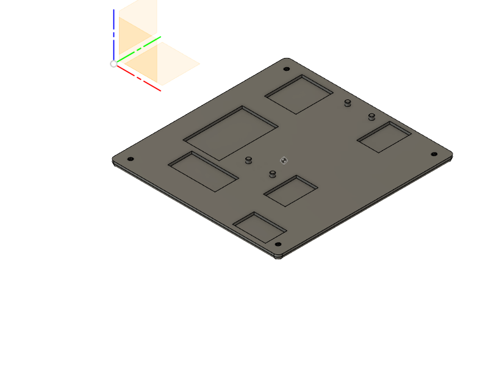

# Enclosure

The main body:

The top lid, designed to be glued on after assembly. "tbd" is supposed to be the kids name, to be printed in a different color than the top lid itself:

The bottom, designed to be fixed to the main body with four small screws:

The location of the components inside the enclosure in the design:

A first alpha print:

